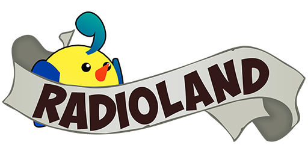

# 

## Factsheet

**Developer:**  
SNAB TM

**Founding date:**  
September 17, 2014

**Website:**  
[radioland.github.io][homepage]

**Press / Business contact:**  
[RadiolandGame@gmail.com][contact]

**Social:**  
[twitter.com/RadiolandGame][twitter]  

## Description

Radioland is a single player 3D third-person puzzle platformer set on a chain of floating islands. The player controls Gunther as he explores four season-themed levels. As the player navigates through jumping challenges, they search for and collect audio logs. These audio logs reveal snippets of four narratives each focusing on communication.

This game was the result of three months of work in Experimental Game Design with continued development in the spring of 2015. We used Unity3D with C#.

<!--
## History

### Beginning

Lorem ipsum dolor sit amet, consectetur adipiscing elit, sed do eiusmod tempor incididunt ut labore et dolore magna aliqua. Ut enim ad minim veniam, quis nostrud exercitation ullamco laboris nisi ut aliquip ex ea commodo consequat. Duis aute irure dolor in reprehenderit in voluptate velit esse cillum dolore eu fugiat nulla pariatur. Excepteur sint occaecat cupidatat non proident, sunt in culpa qui officia deserunt mollit anim id est laborum.

### Second subhed if you want it!

Lorem ipsum dolor sit amet, consectetur adipiscing elit, sed do eiusmod tempor incididunt ut labore et dolore magna aliqua. Ut enim ad minim veniam, quis nostrud exercitation ullamco laboris nisi ut aliquip ex ea commodo consequat. Duis aute irure dolor in reprehenderit in voluptate velit esse cillum dolore eu fugiat nulla pariatur. Excepteur sint occaecat cupidatat non proident, sunt in culpa qui officia deserunt mollit anim id est laborum.
-->

## Videos

<video width="100%" controls="">
    <source src="/assets/video/RadiolandGDCTrailer.mp4" type="video/mp4" />
    <source src="/assets/video/RadiolandGDCTrailer.webm" type="video/webm" />
</video>

## Images

download all screenshots & photos as ** [.zip (6.74 MB)](assets/images/images.zip "Images zip") **

## Logo & Icon

download logo files as ** [.zip (408 KB)]( assets/images/logo.zip "Logo & Icon zip") **

<!--
## Awards & Recognition

> * "Winner, XX awards." - *game name, December 13, 2013*
> * "Nominee, YY awards." - *game name, December 13, 2013*

## Selected Articles

> * "Quote quote quote."  
-- *Person Name, [Website](http://www.website.com/)*

> * "More quotes."  
-- *Person name, [Site](http://geocities.blog.com/)*

## Additional Links

**Company Link #1**  
Link to your company, or some affiliate. Located [here](https://link)

**Company Link #2**  
Another of these. See [here](https://link)
-->

## Team

**Scott Todd**  
[Programmer](http://scotttodd.github.io/)

**Neale LaPlante**  
[Writer](http://diokatsu.wix.com/portfolio/)

**Annie Sardelis**  
[Artist](http://asardelis3.wix.com/portfolio/)

**Brian Tam**  
[Technical Artist](http://xinoph.github.io/)

**Tim Terrezza**  
[Programmer](https://github.com/timmyterrezza/)

**Matt Wellins**  
[Composer](http://mattwellins.com/)

## Contact

**Inquiries**  
[RadiolandGame@gmail.com][contact]

**Twitter**  
[twitter.com/RadiolandGame][twitter]

**Web**  
[http://radioland.github.io][homepage]

<!--- =====================================================================  -->
<!--- Referenced links -->

[homepage]: http://radioland.github.io "Radioland"

[contact]: mailto:RadiolandGame@gmail.com

<!--- Social -->

[twitter]: https://twitter.com/RadiolandGame

