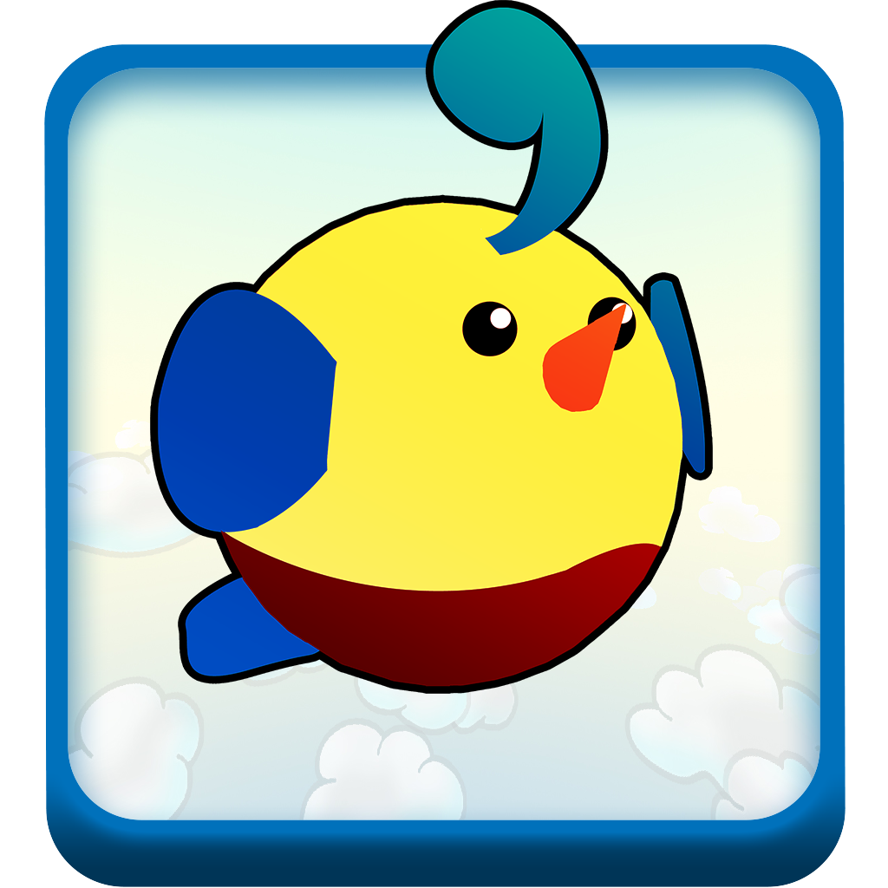

# 

## Factsheet

**Developer:**  
SNAB TM

**Founding date:**  
September 17, 2014

**Website:**  
[radioland.github.io][homepage]

**Press / Business contact:**  
[RadiolandGame@gmail.com][contact]

**Social:**  
[twitter.com/RadiolandGame][twitter]  

**Download Link:**  
[Link][download]  

## Description

Join Gunther in Radioland, where you guide our lovable hero in helping the critters of Radioland get life back from the silence that has surrounded them. In this 3D puzzle platformer, use the power of radio to traverse colorful environments, solve puzzles, and collect crazy outfits. Turn on the radio towers, move the environment, complete the levels and guide Radioland back to a brighter future!

This game was the result of three months of work in Experimental Game Design with continued development in the spring of 2015. We used Unity3D with C#, Maya, and Photoshop. We stream live internet radio using a third-party DLL called BASS from Un4seen Developments. Notable programming feats include audio spectrum visualization, spline editor tools supporting mesh generation, a triggered event/effects system, editor scripting, and physics using kinematic rigidbodies. Our art style is achieved through ShaderLab shaders which we wrote for tri-planar texture mapping and vertex colored PBR.

[Download the GameFest build here!](https://drive.google.com/file/d/0B39TY8FLCiYDVnI2QVAtUU1wOHM/view?usp=sharing)

<!--
## History

### Beginning

Lorem ipsum dolor sit amet, consectetur adipiscing elit, sed do eiusmod tempor incididunt ut labore et dolore magna aliqua. Ut enim ad minim veniam, quis nostrud exercitation ullamco laboris nisi ut aliquip ex ea commodo consequat. Duis aute irure dolor in reprehenderit in voluptate velit esse cillum dolore eu fugiat nulla pariatur. Excepteur sint occaecat cupidatat non proident, sunt in culpa qui officia deserunt mollit anim id est laborum.

### Second subhed if you want it!

Lorem ipsum dolor sit amet, consectetur adipiscing elit, sed do eiusmod tempor incididunt ut labore et dolore magna aliqua. Ut enim ad minim veniam, quis nostrud exercitation ullamco laboris nisi ut aliquip ex ea commodo consequat. Duis aute irure dolor in reprehenderit in voluptate velit esse cillum dolore eu fugiat nulla pariatur. Excepteur sint occaecat cupidatat non proident, sunt in culpa qui officia deserunt mollit anim id est laborum.
-->

## Videos

<iframe width="1280" height="720" src="https://www.youtube.com/embed/HbTQizZzDiM?rel=0" frameborder="0" allowfullscreen></iframe>

## Images

download all screenshots & photos as ** [.zip (6.40 MB)](assets/images/images.zip "Images zip") **

## Logo & Icon

download logo files as ** [.zip (408 KB)]( assets/images/logo.zip "Logo & Icon zip") **

## Awards & Recognition

> * "Second Place in the 'Vicarious Visions Student Challenge' at [Rensselaer Polytechnic Institute's GameFest 2015](http://gamefest.rpi.edu/)" - *May 2, 2015*

<!--
## Selected Articles

> * "Quote quote quote."  
-- *Person Name, [Website](http://www.website.com/)*

> * "More quotes."  
-- *Person name, [Site](http://geocities.blog.com/)*

## Additional Links

**Company Link #1**  
Link to your company, or some affiliate. Located [here](https://link)

**Company Link #2**  
Another of these. See [here](https://link)
-->

## Team

**Scott Todd**  
[Programmer](http://scotttodd.github.io/)

**Neale LaPlante**  
[Writer](http://diokatsu.wix.com/portfolio/)

**Annie Sardelis**  
[Artist](http://asardelis3.wix.com/portfolio/)

**Brian Tam**  
[Technical Artist](http://xinoph.github.io/)

**Tim Terrezza**  
[Programmer](https://github.com/timmyterrezza/)

**Matt Wellins**  
[Composer](http://mattwellins.com/)

## Contact

**Inquiries**  
[RadiolandGame@gmail.com][contact]

**Twitter**  
[twitter.com/RadiolandGame][twitter]

**Web**  
[http://radioland.github.io][homepage]

<!--- =====================================================================  -->
<!--- Referenced links -->

[homepage]: http://radioland.github.io "Radioland"

[contact]: mailto:RadiolandGame@gmail.com

<!--- Social -->

[twitter]: https://twitter.com/RadiolandGame

[download]: https://drive.google.com/file/d/0B39TY8FLCiYDVnI2QVAtUU1wOHM/view?usp=sharing
